# java-messaging-idempotency-tests

Testes de integração para cenários de **mensageria (Kafka)**, **cache (Redis)** e **persistência (PostgreSQL/Hibernate)** — cobrindo idempotência, reprocessamento e Dead Letter Queue (DLQ), com Spring Boot.


## 🚀 Como Começar

```bash
# 1. Clone o repositório
git clone https://github.com/moiseschiaretto/java-messaging-idempotency-tests.git
cd java-messaging-idempotency-tests

# 2. Suba a infraestrutura (Kafka, PostgreSQL, Redis)
docker compose up -d

# 3. Confirme que os 3 containers estão saudáveis
docker ps
# Esperado: messaging-kafka, messaging-postgres e messaging-redis, todos "healthy"

# 4. Rode os testes (recomendado)
mvn test allure:serve   # roda os testes e já abre o relatório visual no navegador

# Ou execute separadamente:
mvn test                 # só executa os testes
mvn allure:serve         # só gera/abre o relatório (precisa ter rodado os testes antes)
```

> Pré-requisitos: JDK 17, Maven e Docker Desktop instalados.

## 🔌 Testando a conexão com cada serviço (opcional)

Antes de rodar os testes, é possível confirmar manualmente que cada serviço da infraestrutura está respondendo:

```bash
# PostgreSQL
docker exec messaging-postgres pg_isready -U messaging_user -d messaging_db
# Esperado: "accepting connections"

# Redis
docker exec messaging-redis redis-cli ping
# Esperado: "PONG"

# Kafka
docker exec messaging-kafka /opt/kafka/bin/kafka-broker-api-versions.sh --bootstrap-server localhost:9092
# Esperado: lista das APIs suportadas pelo broker
```

## Relatório Allure

```bash
mvn test allure:serve   # roda os testes + gera + abre o relatório no navegador
```

> ⚠️ **Não abra o relatório do Allure direto pelo navegador via `file://`.** Assim como outras ferramentas de relatório baseadas em JS, ele carrega os dados via requisições que o navegador bloqueia por segurança quando o HTML é aberto localmente sem servidor. Use sempre `mvn allure:serve` (ou `mvn test allure:serve`), que já sobe o servidor local e abre o relatório completo.

Comandos individuais, se preferir rodar por etapas:

```bash
mvn test                          # roda os testes e gera os dados brutos em target/allure-results/
mvn allure:report                 # gera o HTML estático em target/site/allure-maven-plugin/
mvn allure:serve                  # sobe um servidor local e abre o relatório já pronto
```

## Verificando o cache Redis após os testes (opcional)

```bash
docker exec messaging-redis redis-cli KEYS "*"
```

## Encerrando o ambiente

```bash
docker compose down
```

---

## 📸 Evidências de execução

**Estrutura do projeto no IntelliJ:**

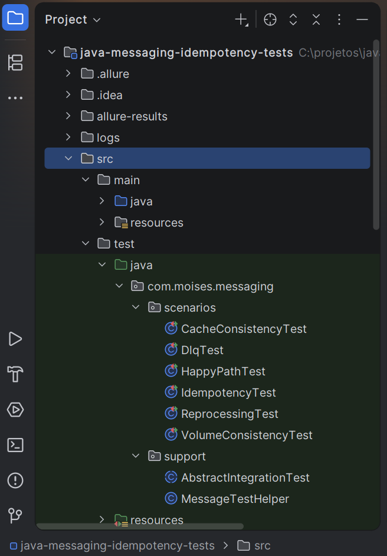

**Infraestrutura Docker de pé (Kafka, PostgreSQL, Redis):**

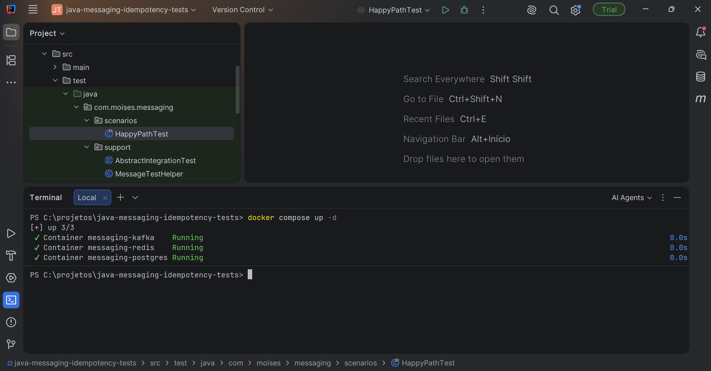
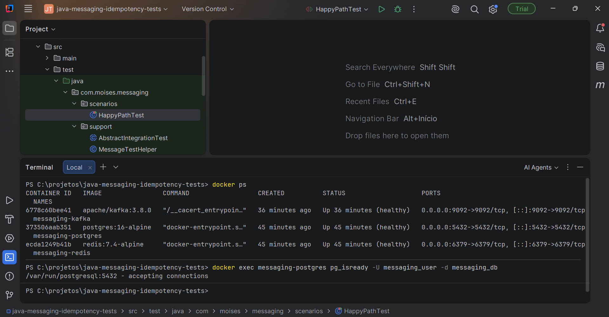

**Teste individual de conexão com cada serviço:**

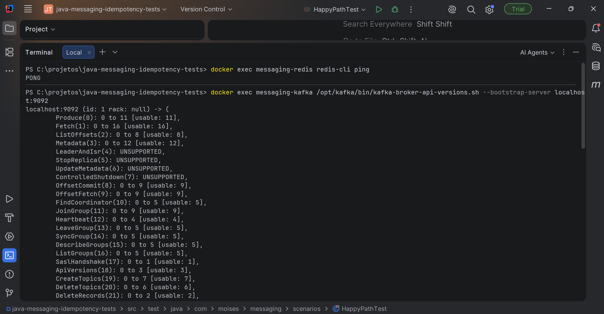

**Persistência confirmada no PostgreSQL (tabela `orders`):**

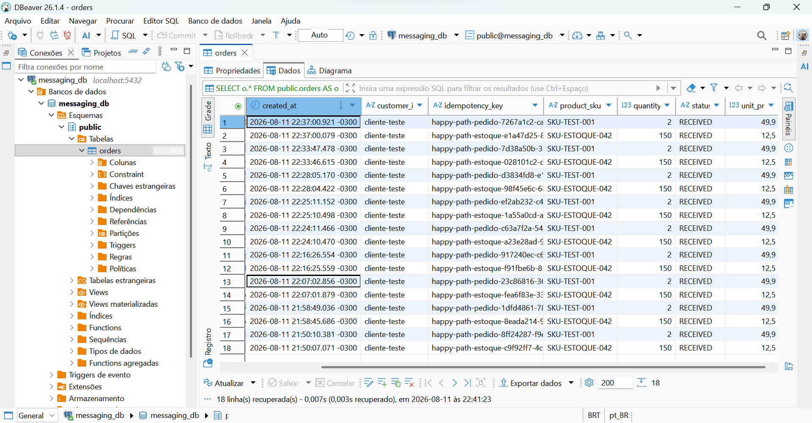

**Cache populado no Redis após a execução dos testes:**

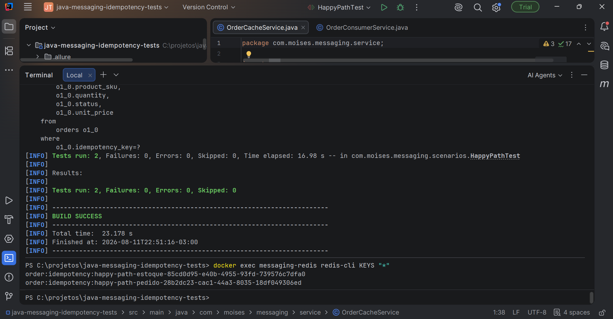

**Execução de cada categoria de teste:**

*Happy Path*
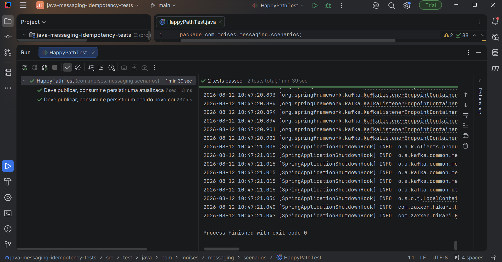

*Idempotência*
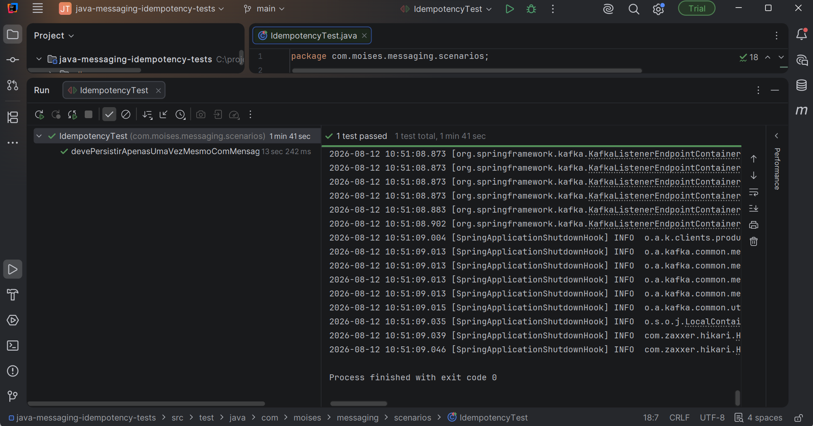

*Reprocessamento*
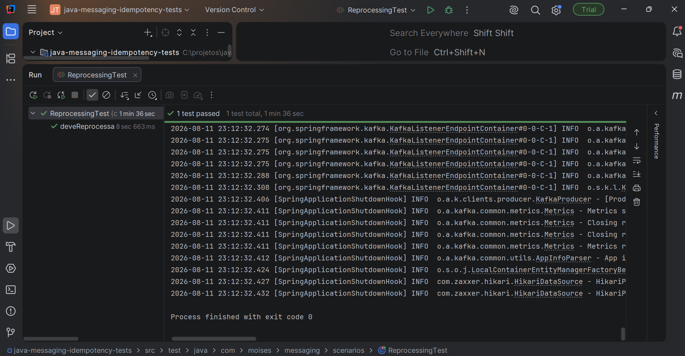

*Dead Letter Queue*
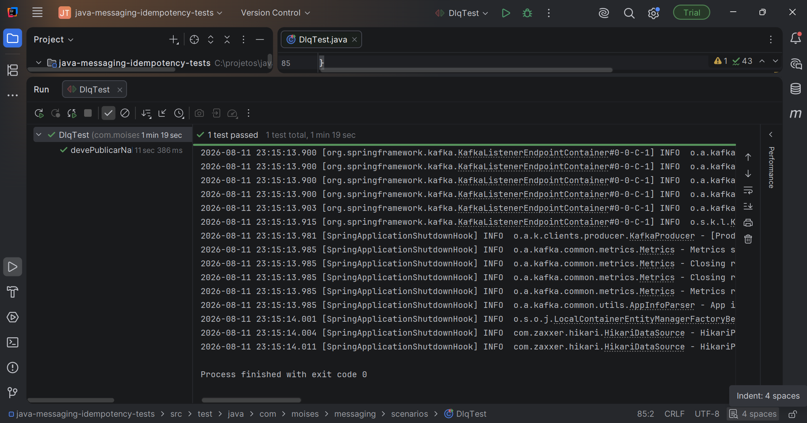

*Consistência de Cache*
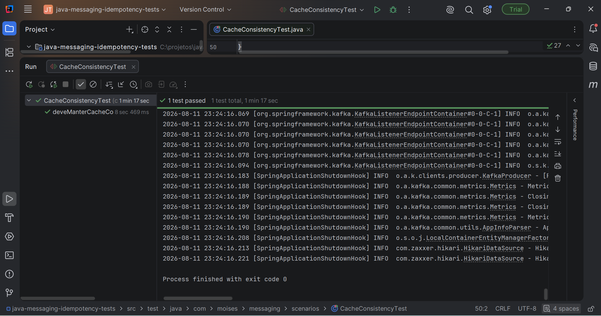

*Consistência sob Volume*
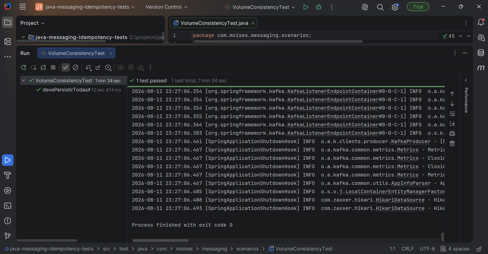

**Relatório Allure consolidado — 7 casos de teste, 100% de sucesso:**

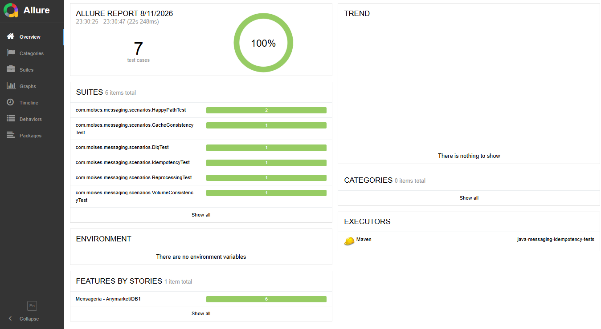
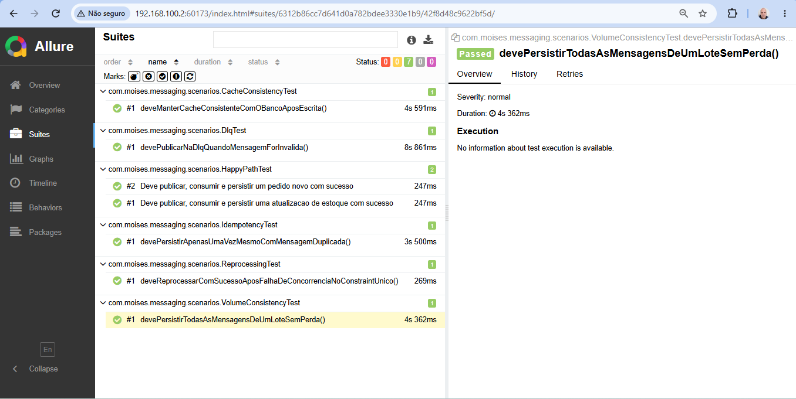
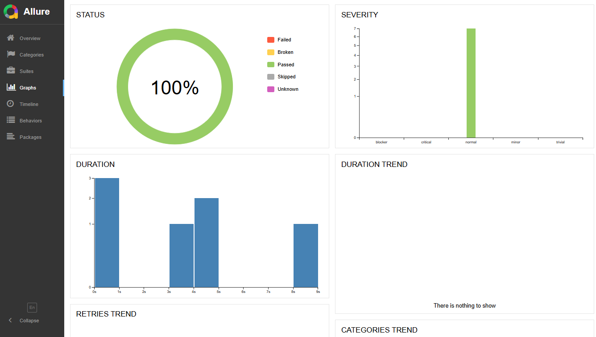

---

## Por que estes cenários específicos?

Cada teste deste projeto foi desenhado para provar, na prática, um comportamento que é comum — e crítico — em sistemas baseados em mensageria assíncrona:

**Idempotência.** Em qualquer sistema distribuído, uma mensagem pode ser entregue mais de uma vez (retry de rede, reprocessamento manual, falha momentânea do consumer). Sem controle de idempotência, isso gera pedidos duplicados, cobranças duplicadas, estoque incorreto. O teste `IdempotencyTest` publica a mesma mensagem duas vezes e confirma que o sistema processa apenas a primeira, ignorando a segunda sem erro.

**Reprocessamento.** Falhas transitórias acontecem (concorrência no banco, timeout momentâneo). Um sistema robusto tenta de novo automaticamente, sem intervenção manual, e sem duplicar o resultado quando a nova tentativa é bem-sucedida. O teste `ReprocessingTest` simula uma corrida de concorrência real e confirma que o mecanismo de retry do Kafka resolve o conflito sozinho.

**Dead Letter Queue (DLQ).** Nem toda mensagem inválida se corrige tentando de novo — um payload malformado continuará malformado. Em vez de travar a fila inteira ou entrar em loop de tentativas inúteis, mensagens assim são desviadas para um tópico separado (a DLQ), para investigação posterior, sem bloquear o processamento das mensagens válidas. O teste `DlqTest` confirma esse desvio.

**Consistência de cache.** Um cache desatualizado (stale) é pior do que não ter cache — o sistema passa a responder com dado errado. O teste `CacheConsistencyTest` confirma que, a cada escrita no banco, o cache Redis é atualizado de forma consistente com o dado real.

**Consistência sob volume.** Um sistema pode funcionar bem com 1 mensagem e falhar silenciosamente com 200 (perda de mensagens, deadlocks, timeouts). O teste `VolumeConsistencyTest` publica um lote de 200 mensagens simultâneas e confirma que todas — sem exceção — são processadas e persistidas corretamente.

## Stack

- **Java 17** + **Spring Boot 3.3.4**
- **Apache Kafka** (modo KRaft, sem Zookeeper) — mensageria
- **PostgreSQL** + **Hibernate/JPA** — persistência
- **Redis** — cache (estratégia cache-aside com invalidação)
- **Spring Actuator + Micrometer** — observabilidade (métricas de mensagens processadas/ignoradas)
- **JUnit 5**, **AssertJ**, **Awaitility** — testes de integração
- **Allure Framework** — relatórios de teste
- **Docker Compose** — orquestração da infraestrutura local

## Estrutura

```
src/
  main/java/com/moises/messaging/
    config/       # configuração de Kafka (retry/DLQ) e Redis (serialização)
    controller/   # endpoint REST de entrada (POST /orders)
    dto/          # objetos de requisição/resposta
    entity/       # entidade Order (JPA)
    exception/    # exceções de domínio
    repository/   # acesso a dados (Spring Data JPA)
    service/      # regras de negócio: publicação, consumo, cache
  test/java/com/moises/messaging/
    scenarios/    # as 6 classes de teste, uma por cenário
    support/      # infraestrutura de apoio compartilhada entre os testes
docker-compose.yml
pom.xml
docs/evidence/    # capturas de tela da execução e dos relatórios
```

## Cobertura de cenários

**6 categorias de teste**, cobrindo o ciclo completo de uma mensagem: publicação, consumo, validação, idempotência, retry, DLQ, persistência e cache — o conjunto de competências técnicas mais exigido em vagas de plataforma/enabling para times de e-commerce e integração de sistemas.
